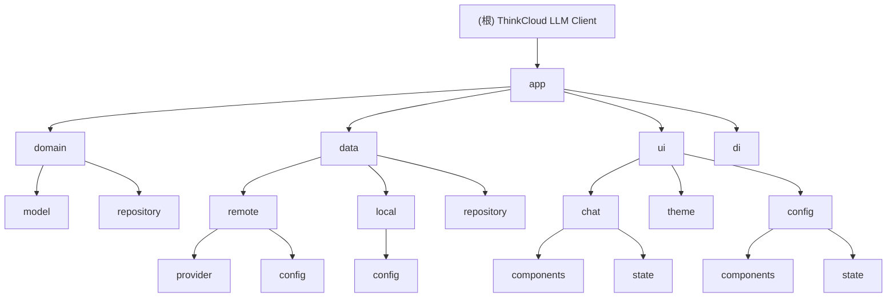

# ThinkCloud LLM Client - Android 项目架构文档

## 项目愿景

ThinkCloud LLM Client 是一个基于 Jetpack Compose 的多供应商 LLM 客户端 Android 应用，支持 DeepSeek、通义千问、Kimi 等多个大模型供应商。采用 MVVM + Repository 架构，提供安全、高效、可扩展的 AI 对话体验。

## 架构总览

本项目采用现代化的 Android 架构，基于以下技术栈：

- **开发语言**: Kotlin
- **UI 框架**: Jetpack Compose + Material Design 3
- **架构模式**: MVVM + Repository + Clean Architecture
- **依赖注入**: Koin
- **网络请求**: Retrofit + OkHttp
- **安全存储**: Android Keystore + EncryptedSharedPreferences
- **异步处理**: Kotlin Coroutines + Flow
- **构建工具**: Gradle (Kotlin DSL)
- **目标平台**: Android 24+ (minSdk 24)

## 模块结构图



## 模块索引

| 模块 | 路径 | 类型 | 语言 | 职责描述 |
|------|------|------|------|----------|
| app | `app/` | Android 应用 | Kotlin | 主应用模块，包含完整的 MVVM 架构实现 |

## 核心架构特性

### 多供应商支持
- **DeepSeek**: 支持官方 API 和阿里云百炼/Model Studio
- **通义千问**: 基于阿里云 DashScope API
- **Kimi**: 基于月之暗面官方 API
- **可扩展性**: 通过 Provider 接口轻松添加新供应商

### 安全设计
- **API 密钥管理**: 使用 Android Keystore 和 EncryptedSharedPreferences
- **网络通信**: HTTPS + 证书验证
- **数据保护**: 本地敏感数据加密存储

### 用户体验
- **流式响应**: 支持实时流式输出显示
- **模型切换**: 动态切换不同供应商和模型
- **错误处理**: 完善的错误提示和重试机制
- **双界面**: 聊天界面 + API 密钥配置界面

## 运行与开发

### 环境要求
- Android Studio Flamingo 或更高版本
- JDK 11
- Android SDK 36 (API 36)

### 构建与运行
```bash
# 构建项目
./gradlew build

# 运行测试
./gradlew test
./gradlew connectedAndroidTest

# 清理构建
./gradlew clean
```

### 开发工作流
1. 使用 Android Studio 打开项目
2. 配置 API 密钥（通过设置界面）
3. 连接 Android 设备或启动模拟器
4. 运行 `./gradlew assembleDebug` 构建调试版本
5. 部署到设备进行测试

## 测试策略

### 单元测试
- **位置**: `app/src/test/`
- **框架**: JUnit 4
- **覆盖范围**: 业务逻辑、工具类、ViewModel

### 仪器化测试
- **位置**: `app/src/androidTest/`
- **框架**: AndroidJUnit4
- **覆盖范围**: UI 交互、集成测试、API 调用

## 编码规范

### Kotlin 代码规范
- 遵循 Kotlin 官方编码约定
- 使用 4 空格缩进
- 类名使用 PascalCase
- 函数和变量名使用 camelCase

### 架构规范
- **领域层**: 纯 Kotlin，无 Android 依赖
- **数据层**: 实现 Repository 接口，处理数据源
- **UI 层**: Jetpack Compose，遵循单向数据流
- **依赖注入**: 使用 Koin 管理依赖关系

### Compose 最佳实践
- 使用 `@Composable` 注解标记可组合函数
- 遵循单向数据流原则
- 合理使用状态提升
- 保持可组合函数的纯净性

## AI 使用指引

### 代码理解与生成
- 本项目采用 MVVM + Repository 架构模式
- 使用 Jetpack Compose 作为 UI 框架
- 遵循 Clean Architecture 分层原则
- 支持多 LLM 供应商的插件化设计

### 架构演进建议
- 考虑引入模块化架构以支持功能扩展
- 评估是否需要添加离线缓存功能
- 规划国际化支持
- 考虑添加对话历史持久化

## 变更记录 (Changelog)

### 2025-11-28 19:18:27
- 更新架构文档，详细记录 LLM Client 特性
- 完善多供应商架构设计说明
- 添加配置界面和双界面切换功能
- 更新模块结构图，包含配置模块
- 完善安全配置和依赖注入说明

### 2025-11-28
- 更新架构文档，反映 LLM Client 特性
- 详细记录多供应商架构设计
- 完善安全配置和依赖注入说明
- 更新模块结构图

### 2025-11-27
- 初始架构文档创建
- 项目结构分析完成
- 模块文档生成

---

*本文档由 Claude Code 自动生成，最后更新于 2025-11-28 19:18:27*