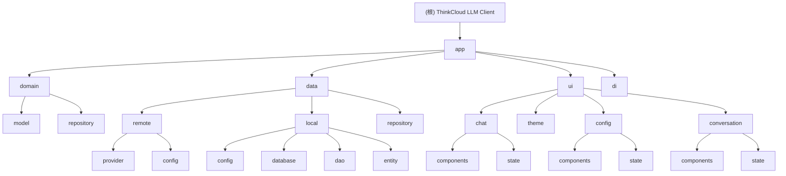

# ThinkCloud LLM Client - Android 项目架构文档

## 📋 文档结构说明

本项目采用**根级简明 + 模块级详尽**的文档组织策略：

- **根目录**: 保留最简架构概览和快速导航
- **`/doc` 目录**: 存放详细功能文档和指南
- **`/app/CLAUDE.md`**: 模块级详细架构文档

## 🎯 项目愿景

ThinkCloud LLM Client 是一个基于 Jetpack Compose 的多供应商 LLM 客户端 Android 应用，支持 DeepSeek、通义千问、Kimi 等多个大模型供应商。采用 MVVM + Repository 架构，提供安全、高效、可扩展的 AI 对话体验，支持对话历史持久化和主题定制。

## 🏗️ 架构总览

本项目采用现代化的 Android 架构，基于以下技术栈：

- **开发语言**: Kotlin
- **UI 框架**: Jetpack Compose + Material Design 3
- **架构模式**: MVVM + Repository + Clean Architecture
- **依赖注入**: Koin
- **网络请求**: Retrofit + OkHttp
- **本地存储**: Room Database
- **安全存储**: Android Keystore + EncryptedSharedPreferences
- **异步处理**: Kotlin Coroutines + Flow
- **构建工具**: Gradle (Kotlin DSL)
- **目标平台**: Android 24+ (minSdk 24)

## 📊 模块结构图



## 📁 模块索引

| 模块 | 路径 | 类型 | 语言 | 职责描述 |
|------|------|------|------|----------|
| app | `app/` | Android 应用 | Kotlin | 主应用模块，包含完整的 MVVM 架构实现 |

## 🔗 详细文档导航

### 📚 项目文档
- **[README.md](README.md)** - 项目介绍和快速开始指南
- **[doc/CONTRIBUTING.md](doc/CONTRIBUTING.md)** - 贡献指南和开发规范
- **[doc/CHANGELOG.md](doc/CHANGELOG.md)** - 变更日志和版本历史
- **[doc/USAGE.md](doc/USAGE.md)** - 使用指南和功能说明

### 🔧 开发与调试
- **[doc/DEBUG_GUIDE.md](doc/DEBUG_GUIDE.md)** - 调试指南和问题排查
- **[doc/STREAMING_DEBUG.md](doc/STREAMING_DEBUG.md)** - 流式显示诊断指南
- **[doc/SCROLL_FEATURE.md](doc/SCROLL_FEATURE.md)** - 聊天界面滚动功能说明
- **[doc/QWEN_TEST_GUIDE.md](doc/QWEN_TEST_GUIDE.md)** - 通义千问对话功能测试指南

### 🏛️ 架构文档
- **[app/CLAUDE.md](app/CLAUDE.md)** - app 模块详细架构文档

## 🚀 快速开始

### 构建与运行
```bash
# 构建项目
./gradlew build

# 运行应用
./gradlew installDebug

# 运行测试
./gradlew test
./gradlew connectedAndroidTest
```

### 开发环境
- **Android Studio**: Flamingo 或更高版本
- **JDK**: 11
- **Android SDK**: API 36
- **目标平台**: Android 24+ (minSdk 24)

## 📝 AI 使用指引

### 代码理解与生成
- 本项目采用 MVVM + Repository 架构模式
- 使用 Jetpack Compose 作为 UI 框架
- 遵循 Clean Architecture 分层原则
- 支持多 LLM 供应商的插件化设计
- Room 数据库实现对话历史持久化

### 架构演进建议
- ✅ 已完成对话历史持久化
- ✅ 已实现主题定制功能
- ✅ 已增强调试功能（状态变化日志、消息气泡更新追踪）
- ✅ 已优化流式显示（节流和视觉指示器）
- 考虑引入模块化架构以支持功能扩展
- 评估是否需要添加离线缓存功能
- 规划国际化支持
- 考虑添加云端同步功能

---

*本文档由 Claude Code 自动生成，最后更新于 2025-12-02 20:34:00*